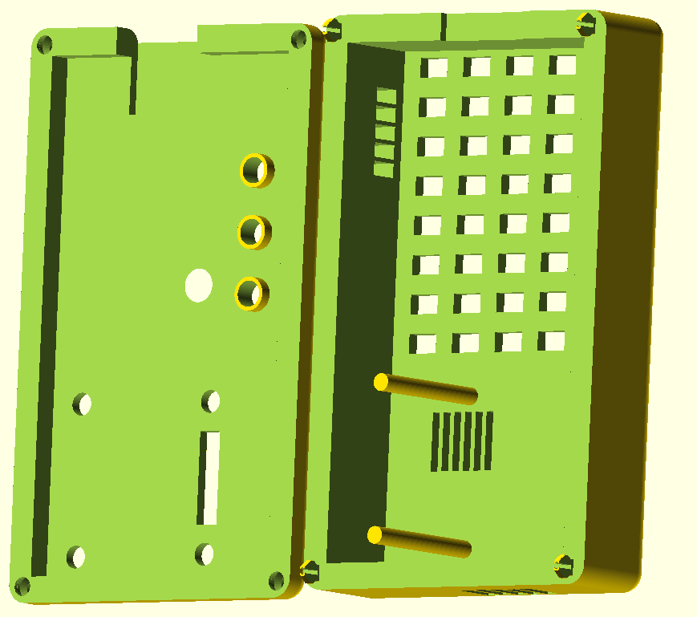
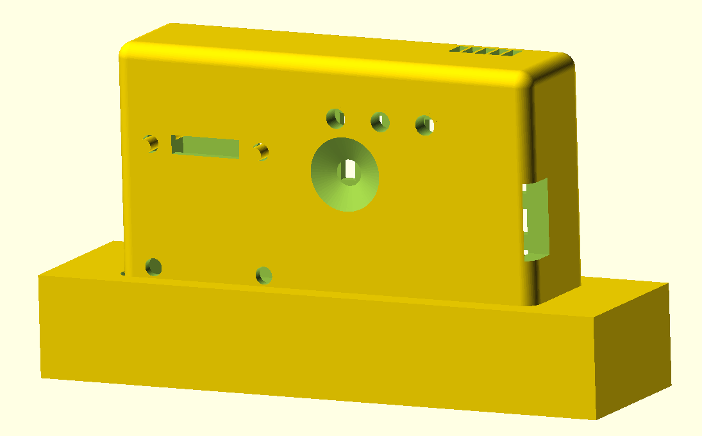

# Case

The stand is created with OpenSCAD. 

The case comes in 2 parts, a top and a bottom, and there is an optional stand for holding the case upright. 
- [IAQ-C3-base.stl](IAQ-C3-base.stl) - The main case that the board goes into
- [IAQ-C3-top.stl](IAQ-C3-top.stl) - The top that fits onto the case. This uses snap fittings to attach to the case. 
- [IAQ-C3-stand.stl](IAQ-C3-stand.stl) - An optional stand for holding the completed case vertically

Stand:
